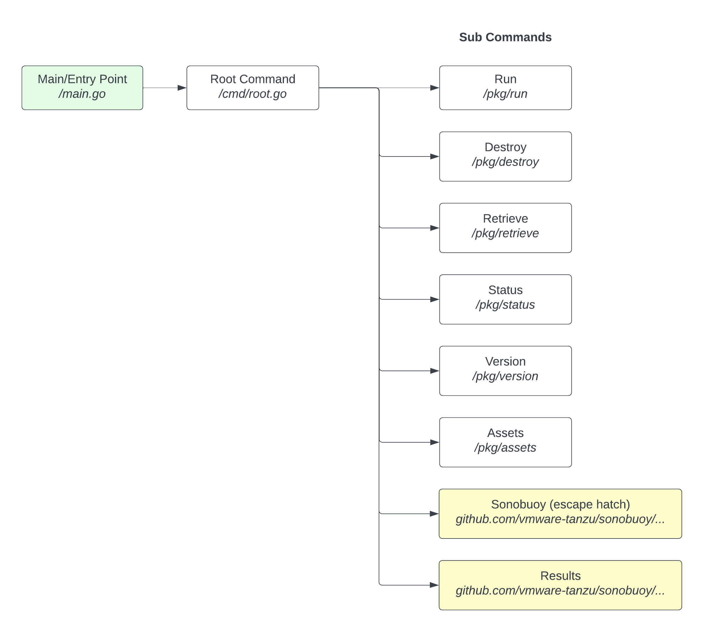

# Provider Certification Tool

## Release

Releasing a new version of the provider certification tool is done automatically through [this GitHub Action](https://github.com/redhat-openshift-ecosystem/provider-certification-tool/blob/main/.github/workflows/release.yaml)
which is run on new tags. Tags should be named in format: v0.1.0. 

Tags should only be created from the `main` branch which only accepts pull-requests that pass through [this CI GitHub Action](https://github.com/redhat-openshift-ecosystem/provider-certification-tool/blob/main/.github/workflows/go.yaml).

Note that any version in v0.* will be considered part of the preview release of the certification tool.

## Development Notes

This tool builds heavily on 
[Sonobuoy](https://sonobuoy.io) therefore at least
some high level knowledge of Sonobuoy is needed to really understand this tool. A 
good place to start with Sonobuoy is [its documentation](https://sonobuoy.io/docs).

The OpenShift provider certification tool extends Sonobuoy in two places:

- Command line interface (CLI)
- Plugins

### Command Line Interface

Sonobuoy provides its own CLI but it has a considerable number of flags and options
which can be overwhelming. This isn't an issue with Sonobuoy, it's just the result
of being a very flexible tool. However, for simplicity sake, the OpenShift
certification tool extends the Sonobuoy CLI with some strong opinions specific
to the realm certifying OpenShift on new infrastructure. 

#### Integration with Sonobuoy CLI
The OpenShift provider certification tool's CLI is written in Golang so that extending 
Sonobuoy is easily done. Sonobuoy has two specific areas on which we build on:

- Cobra commands (e.g. [sonobuoy run](https://github.com/vmware-tanzu/sonobuoy/blob/87e26ab7d2113bd32832a7bd70c2553ec31b2c2e/cmd/sonobuoy/app/run.go#L47-L62))
- Sonobuoy Client ([source code](https://github.com/vmware-tanzu/sonobuoy/blob/87e26ab7d2113bd32832a7bd70c2553ec31b2c2e/pkg/client/interfaces.go#L246-L250))

Ideally, the OpenShift Provider Cert tool's commands will interact with the Sonobuoy Client API. There may be some
situations where this isn't possible and you will need to call a Sonobuoy's Cobra Command directly. Keep in mind,
executing a Cobra Command directly adds some odd interaction; this should be avoided since the ability to cleanly \
set Sonobuoy's flags may be unsafe in code like below. The code below won't fail at compile time if there's a change
in Sonobuoy and there's also no type checking happening:

```golang
// Not Great
runCmd.Flags().Set("dns-namespace", "openshift-dns")
runCmd.Flags().Set("kubeconfig", r.config.Kubeconfig)
```

Instead, use the Sonobuoy Client includes with the project like this:

```golang
// Great
reader, ec, err := config.SonobuoyClient.RetrieveResults(&client.RetrieveConfig{
    Namespace: "sonobuoy",
    Path:      config2.AggregatorResultsPath,
})
```

### Sonobuoy Plugins

*TODO* (Cert tool's plugin development is still in POC phase)

### Diagrams

Here's the highest level diagram showing the filenames or packages for code:


### Running Customized Certification Plugins

In some situations, you may need to modify the certification plugins that are run by the certification tool. 
Running the certification tool with customized plugin manifests cannot be used for final certification of an OpenShift cluster! 
If you find issues or changes that are needed for certification to complete, please open a GitHub issue or reach out to your Red Hat contact assisting with certification.  

1. Export default certification plugins to local filesystem:
```
openshift-provider-cert assets /tmp
INFO[2022-06-16T15:35:29-06:00] Asset openshift-conformance-validated.yaml saved to /tmp/openshift-conformance-validated.yaml 
INFO[2022-06-16T15:35:29-06:00] Asset openshift-kube-conformance.yaml saved to /tmp/openshift-kube-conformance.yaml 
```
2. Make your edits to the exported YAML assets:
```
vi /tmp/openshift-kube-conformance.yaml
```
3. Launch certification tool with customized plugin:
```
openshift-provider-cert run --plugin /tmp/openshift-kube-conformance.yaml --plugin /tmp/openshift-conformance-validated.yaml
```

### Project Documentation

The documentation is available in the directory `docs/`. You can render it as HTML using `mkdocs` locally - it's not yet published the HTML version.

To run locally you should be using `python >= 3.8`, and install the `mkdocs` running:

```
pip install hack/docs-requirements.txt
```

Then, under the root of the project, run:

```
mkdocs serve
```

Then you will be able to access the docs locally on the address: http://127.0.0.1:8000/
